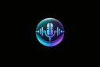
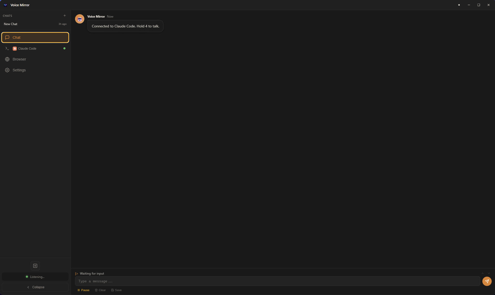
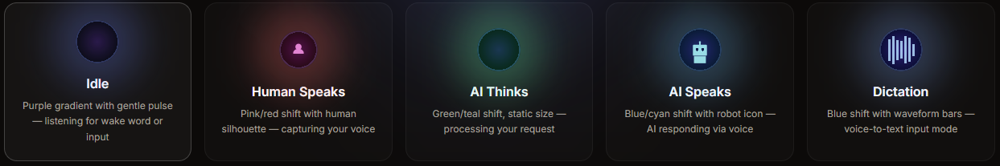

# Voice Mirror

<p align="center">
  
</p>

<p align="center">
  <strong>Voice-controlled AI agent overlay for your entire computer.</strong><br>
  <sub>Built with Tauri 2, Rust, and Svelte 5.</sub>
</p>

<p align="center">
  <a href="https://www.contextmirror.com">Website</a> •
  <a href="https://discord.com/invite/JBpsSFB7EQ">Discord</a> •
  <a href="#features">Features</a> •
  <a href="#quick-start">Quick Start</a> •
  <a href="#ai-providers">Providers</a> •
  <a href="CHANGELOG.md">Changelog</a> •
  <a href="#license">License</a>
</p>

<p align="center">
  <a href="https://scorecard.dev/viewer/?uri=github.com/contextmirror/voice-mirror-electron"></a>
  <a href="https://www.bestpractices.dev/projects/11950"></a>
  <a href="https://snyk.io/test/github/contextmirror/voice-mirror-electron"></a>
  <a href="https://github.com/contextmirror/voice-mirror-electron"></a>
</p>

<p align="center">
  
  
  
  
  
  <a href="https://discord.com/invite/JBpsSFB7EQ"></a>
</p>

> **Alpha Release** — Voice Mirror is in active development. Core features work and are tested across all platforms, but expect rough edges. Bug reports and feedback welcome via [GitHub Issues](https://github.com/contextmirror/voice-mirror-electron/issues) or [Discord](https://discord.com/invite/JBpsSFB7EQ).

<p align="center">
  
</p>

<p align="center">
  
</p>

---

```
Claude Code / OpenCode = Terminal + MCP Tools
Voice Mirror            = Eyes + Ears + Voice
Combined                = Full AI agent for your entire computer
```

## Why Voice Mirror?

| Existing Product | What's Missing |
|------------------|----------------|
| Siri / Cortana / Alexa | No real capabilities, can't "see" your screen |
| GitHub Copilot | Code only, no voice, IDE-locked |
| Claude Desktop | Not an overlay, no wake word, limited platform |
| ChatGPT Desktop | Just a chat window |

Voice Mirror is an always-on overlay that listens, sees your screen, executes commands, and speaks back — across any AI provider.

---

## What Makes This Different

- **Tauri 2 + Rust native backend** — no Electron, no Node.js runtime in the app. The entire backend is Rust: window management, voice pipeline, AI provider orchestration, config, IPC. Minimal memory footprint and instant startup.
- **Rust-native voice pipeline** — STT (Whisper ONNX), TTS (Kokoro ONNX / Edge TTS), and VAD run directly in the Tauri process via rodio. No child processes, no FFI bridges, no external binaries.
- **Svelte 5 frontend** — reactive UI with Vite HMR. Runes-based stores (`$state`, `$derived`, `$effect`) for real-time state management.
- **Claude Code / OpenCode as PTY-backed brains** — runs Claude Code or OpenCode inside the app as a real terminal. Full MCP tool access with 75+ models via OpenCode, zero extra API cost beyond the CLI itself.
- **Native Rust MCP server** — `voice-mirror-mcp` is a compiled Rust binary using stdio JSON-RPC. Named pipe server for fast MCP-to-app communication with file-based inbox fallback. 58 tools across 10 dynamically-loaded groups.
- **Real browser automation** — not "search and summarize." Actual CDP-level click, type, navigate, screenshot, and DOM snapshot.
- **Unified agent loop** — wake word + screen capture + terminal execution + browser control + persistent memory, all wired together. Most tools pick one; this closes the full Hear > See > Think > Act > Speak > Persist loop.

---

## Features

### Voice Interaction

| Mode | Trigger | Use Case |
|------|---------|----------|
| **Wake Word** | "Hey Claude" | Hands-free, on-demand |
| **Push to Talk** | Mouse button / keyboard | Manual control |
| **Dictation** | Configurable hotkey | Voice-to-text input anywhere |

### Screen Awareness
Capture your screen at any time — the AI sees what you see and can analyze errors, UI, or anything on screen. Multi-monitor support. Images are sent directly to vision-capable LLMs (Ollama, OpenAI, etc.).

### Chat Dashboard
Full chat interface with message history, Slack-style grouped messages, markdown rendering, image paste/drop, and persistent chat sessions. AI activity status bar shows real-time provider state.

### Terminal Power
Claude Code or OpenCode runs inside Voice Mirror with full MCP tool access. Execute commands, manage files, and automate workflows — all by voice. OpenCode unlocks 75+ models (GPT, Gemini, Kimi, local Ollama, and more) through a single integration.

### 58 MCP Tools (10 groups, dynamically loaded)

| Group | Tools | Capabilities |
|-------|-------|-------------|
| **core** | 4 | Voice I/O, presence tracking |
| **memory** | 6 | Semantic search, 3-tier persistent memory |
| **browser** | 16 | Full CDP automation — navigate, click, type, screenshot, cookies, storage |
| **n8n** | 22 | Workflow CRUD, executions, credentials, tags |
| **voice-clone** | 3 | Clone any voice from a 3-second audio sample |
| **screen** | 1 | Desktop screenshot capture |
| **diagnostic** | 1 | Pipeline message tracing |
| **meta** | 3 | Dynamic tool loading/unloading |
| **facades** | 3 | Single-tool wrappers for memory, browser, and n8n (voice-mode efficiency) |

### Speech Recognition

| Engine | Speed | Notes |
|--------|-------|-------|
| **Whisper** (default) | Fast | Whisper ONNX, runs natively in the Rust backend |

### Voice Synthesis

| Engine | Speed | Voice Cloning | Voices |
|--------|-------|---------------|--------|
| **Kokoro** (default) | Fast, CPU | No | 10 built-in |
| **Edge TTS** | Fast, online | No | 400+ Microsoft voices |

---

## AI Providers

10 built-in providers — 75+ models accessible through OpenCode. Local servers are auto-detected.

| Provider | Type | Key Features |
|----------|------|-------------|
| **Claude Code** | CLI agent | Anthropic's gold-standard CLI. MCP tools, vision, full terminal, `CLAUDE.md` ecosystem |
| **OpenCode** | CLI agent | Universal gateway to 75+ models (GPT, Gemini, Kimi, Grok, Mistral, and more). Full MCP tool support |
| **Codex** | CLI agent | OpenAI's CLI agent |
| **Gemini CLI** | CLI agent | Google's CLI agent |
| **Kimi CLI** | CLI agent | Moonshot's CLI agent |
| **Ollama** | Local API | Auto-detect, vision (llava), run models on your own hardware |
| **LM Studio** | Local API | Auto-detect, GUI-based local LLM runner |
| **Jan** | Local API | Auto-detect, open source local AI |
| **OpenAI** | Cloud API | GPT models via API |
| **Groq** | Cloud API | Ultra-fast inference |

---

## Quick Start

### Download (Recommended)

Grab the latest installer from [**GitHub Releases**](https://github.com/contextmirror/voice-mirror-electron/releases):

| Platform | Download |
|----------|----------|
| **Windows** | `Voice-Mirror-Setup-x.x.x.exe` (NSIS installer) |
| **macOS** | `Voice-Mirror-x.x.x.dmg` |
| **Linux** | `Voice-Mirror-x.x.x.AppImage` |

Everything is bundled — no Node.js, Rust, or build tools required. The app checks for updates automatically and notifies you when a new version is available.

### Development Setup

For contributors or running from source:

```bash
git clone https://github.com/contextmirror/voice-mirror-electron.git
cd voice-mirror-electron

# Install JS dependencies (for tests and tooling)
npm install

# Run the Tauri app with hot-reload
cd tauri
cargo tauri dev
```

**Dev requirements:** Node.js 22+, Rust toolchain, LLVM/libclang, CMake

**Verify builds:**

```bash
cd tauri && npx vite build           # Check Svelte frontend
cd tauri/src-tauri && cargo check    # Check Rust backend
cd tauri/src-tauri && cargo test     # Run Rust tests (167)
npm test                             # Run JS tests (1070+)
```

### Optional Dependencies

- **Claude Code CLI** (for Claude provider) or **OpenCode** (for 75+ models)
- **Codex CLI**, **Gemini CLI**, or **Kimi CLI** (for additional CLI providers)
- **ffmpeg** (for voice cloning)
- **CUDA** (optional — GPU acceleration for supported models)

---

## Keyboard Shortcuts

| Shortcut | Action |
|----------|--------|
| `Ctrl+Shift+V` | Toggle panel expand/collapse |
| `Ctrl+Shift+M` | Toggle performance monitor |
| Drag orb | Move orb position |

---

## Configuration

Config is stored per-platform:

| Platform | Path |
|----------|------|
| Linux | `~/.config/voice-mirror/config.json` |
| macOS | `~/Library/Application Support/voice-mirror/config.json` |
| Windows | `%APPDATA%\voice-mirror\config.json` |

Settings are accessible from the in-app Settings page — AI provider, voice, activation mode, audio devices, appearance, and more.

---

## Project Structure

```
voice-mirror/
├── tauri/                     # Tauri 2 application
│   ├── src-tauri/             # Rust backend
│   │   ├── src/
│   │   │   ├── commands/      # Tauri commands (config, window, voice, ai, chat, tools, shortcuts)
│   │   │   ├── config/        # Config management + schema
│   │   │   ├── providers/     # AI providers (CLI PTY + API HTTP)
│   │   │   ├── voice/         # Voice pipeline (STT, TTS, VAD) — runs natively
│   │   │   ├── mcp/           # Built-in MCP server (Rust binary)
│   │   │   └── ipc/           # Named pipe server
│   │   ├── Cargo.toml         # Rust dependencies
│   │   └── tauri.conf.json    # Tauri config
│   └── src/                   # Svelte 5 frontend
│       ├── components/        # Chat, settings, sidebar, overlay, terminal, shared
│       ├── lib/stores/        # Reactive stores (.svelte.js with $state/$derived/$effect)
│       ├── lib/               # Utilities (api.js, markdown.js, utils.js)
│       └── styles/            # CSS (tokens.css, settings.css)
├── electron/                  # Legacy Electron app (still in repo, not the active target)
├── mcp-server/                # Legacy Node.js MCP server
├── test/                      # Test suites
│   ├── tauri/                 # Tauri-era JS tests (1070+)
│   ├── unit/                  # Legacy unit tests
│   └── integration/           # Legacy integration tests
├── chrome-extension/          # Browser relay extension (MV3)
├── cli/                       # Setup wizard + CLI
└── assets/                    # Icons
```

---

## Use Cases

**Developer:**
> "Hey Claude, what's this error on my screen?"
> -> *captures screen, analyzes code, suggests fix*
>
> "Fix it"
> -> *executes commands in terminal*

**Desktop:**
> "What app is using all my memory?"
> -> *checks processes, reports findings via voice*

**Voice Cloning:**
> "Clone David Attenborough's voice from this clip"
> -> *downloads audio, creates clone — all responses now in that voice*

**Automation:**
> "Create an n8n workflow that emails me when my server goes down"
> -> *builds workflow via MCP tools*

---

## Cross-Platform

| Platform | Status | Notes |
|----------|--------|-------|
| Linux | Primary | X11/Wayland, AppImage target |
| Windows | Supported | NSIS installer |
| macOS | Supported | DMG target |

---

## Security & Trust

**Voice Mirror runs its own isolated browser environment. It does not attach to or control your existing browser.**

- **Embedded Chromium** — browser automation operates in a controlled instance launched by the app, not your system browser. No access to your existing sessions, cookies, or logged-in accounts unless you explicitly log in inside Voice Mirror.
- **Tool-mediated actions** — every browser action flows through `LLM -> tool schema -> browser controller -> Chromium`. Actions are enumerable, reviewable, and loggable. No arbitrary JS injection.
- **Explicit screen capture** — screenshots are triggered by tool calls or user request, not captured passively. The orb visually indicates capture state.
- **MCP tool gating** — tool groups load on demand. The LLM can only access tools that have been explicitly loaded for the session.

---

## Environment Variables

| Variable | Provider |
|----------|----------|
| `ANTHROPIC_API_KEY` | Claude Code |

Cloud provider API keys (OpenAI, Google, xAI, etc.) are configured through OpenCode directly — see [OpenCode docs](https://opencode.ai/docs/providers/) for setup.

---

## Testing

```bash
npm test                             # JS tests (1070+ across test/tauri/)
cd tauri/src-tauri && cargo test     # Rust tests (167)
```

1070+ JavaScript tests (node:test + node:assert/strict) covering config safety, API key detection, provider detection, settings, startup behavior, cross-platform paths, terminal rendering, MCP memory, browser automation, IPC validation, structured logging, path safety, and more. 167 Rust tests covering commands, config, providers, voice pipeline, and MCP server.

---

## License

[MIT](LICENSE)

---

<p align="center">
  <sub>Built with Tauri, Rust, Svelte, and a lot of voice commands.</sub>
</p>
