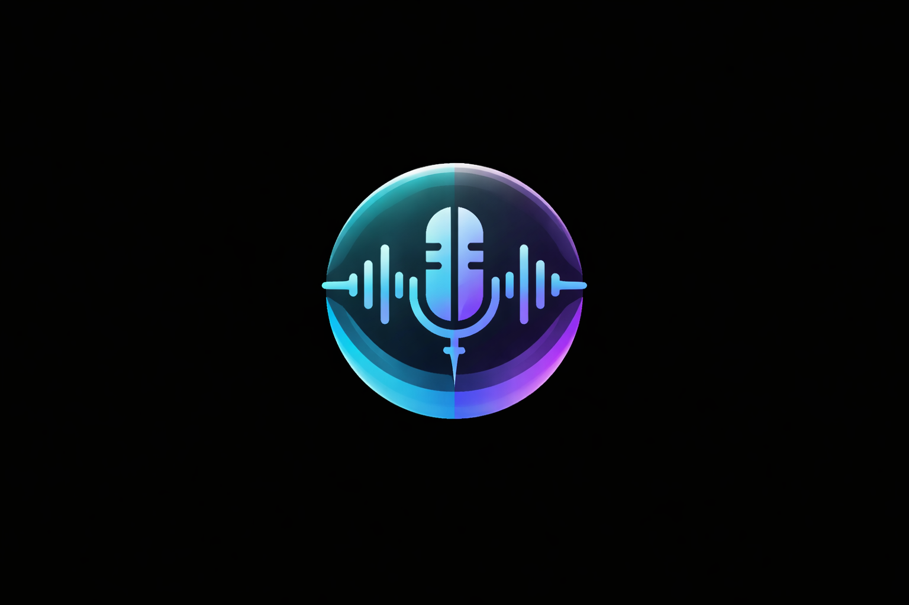

# Voice Mirror Electron

**Voice-controlled AI agent overlay for your entire computer.**

<p align="center">
  
</p>

```
Claude Code = Terminal + MCP Tools
Voice Mirror = Eyes + Ears + Voice
Combined = Full AI agent for your entire computer
```

## What is Voice Mirror?

Voice Mirror Electron is a floating AI assistant overlay that combines:
- **Voice input** - Wake word ("Hey Claude"), call mode, or push-to-talk
- **Voice output** - Natural TTS with voice cloning support
- **Screen awareness** - Capture and analyze what's on your screen
- **Terminal power** - Execute commands through Claude Code
- **Multi-AI support** - Claude, Ollama, OpenAI, and 8+ more providers
- **Memory system** - Persistent semantic memory across conversations
- **Web access** - Search and fetch content from the web

## Quick Start

```bash
# Install dependencies
npm install

# Set up Python backend
cd python
python -m venv .venv
source .venv/bin/activate  # Linux/macOS
pip install -r requirements.txt
cd ..

# Start Voice Mirror
npm start

# Or use the launch script (recommended for Linux):
./launch.sh
```

## Screenshots

### Floating Orb (Collapsed)
```
                                    ◉ ← 64px draggable orb
                                      (pulses when listening)
```

### Expanded Panel
```
┌──────────────────────────────────────────────────┐
│ ◉ Voice Mirror  │                                │
├─────────────────┤  Chat Page                     │
│ 💬 Chat         │  ┌────────────────────────┐    │
│ >_ Claude Code  │  │ You: What's this error?│    │
│ ⚙️ Settings     │  │ Claude: That's a null  │    │
│                 │  │ pointer in line 42...  │    │
│                 │  └────────────────────────┘    │
│ [« Collapse]    │  ● Listening...    [📷]       │
└─────────────────┴────────────────────────────────┘
```

## Features

### Voice Interaction
| Mode | Trigger | Use Case |
|------|---------|----------|
| Wake Word | "Hey Claude" | Hands-free, on-demand |
| Call Mode | Always listening | Continuous conversation |
| Push to Talk | Mouse/keyboard | Manual control |

### AI Providers
| Provider | Type | Features |
|----------|------|----------|
| Claude Code | PTY | MCP tools, vision, terminal |
| Ollama | Local | Auto-detect, vision |
| LM Studio | Local | Auto-detect |
| Jan | Local | Auto-detect |
| OpenAI | Cloud | GPT-4o, vision |
| Gemini | Cloud | Vision |
| Groq | Cloud | Fast inference |
| + 4 more | Cloud | Mistral, OpenRouter, DeepSeek, Grok |

### Voice Synthesis
| Adapter | Features |
|---------|----------|
| Kokoro (default) | 10 voices, fast, CPU |
| Qwen3-TTS | Voice cloning, 9 presets, GPU |

### MCP Tools (14 total)
- **Voice/Chat**: send, inbox, listen, status
- **Memory**: search, get, remember, forget, stats
- **Screen**: capture_screen
- **Browser**: browser_search, browser_fetch
- **Voice Clone**: clone_voice, list/clear clones

## Project Structure

```
Voice Mirror Electron/
├── electron/           # Electron app (main + renderer)
│   ├── services/       # Service modules (8 services)
│   ├── providers/      # Multi-AI provider system
│   ├── browser/        # Playwright web integration
│   ├── tools/          # Tool system for local LLMs
│   ├── js/             # Renderer JavaScript
│   └── styles/         # CSS modules
├── python/             # Voice backend
│   ├── stt/            # Speech-to-text adapters
│   ├── tts/            # Text-to-speech adapters
│   └── audio/          # Wake word, VAD
├── mcp-server/         # MCP server (14 tools)
│   └── lib/memory/     # Memory system
├── docs/               # Documentation
└── assets/             # Icons
```

## Documentation

| Document | Description |
|----------|-------------|
| [ARCHITECTURE.md](docs/ARCHITECTURE.md) | System design, data flow, MCP tools |
| [PYTHON-BACKEND.md](docs/PYTHON-BACKEND.md) | Voice processing, STT/TTS, voice cloning |
| [CONFIGURATION.md](docs/CONFIGURATION.md) | Config schema, settings, voices |
| [DEVELOPMENT.md](docs/DEVELOPMENT.md) | Setup, debugging, troubleshooting |
| [ROADMAP.md](docs/ROADMAP.md) | Progress and future plans |

## Use Cases

**Developer:**
```
"Hey Claude, what's this error on my screen?"
  → captures screen, analyzes code, suggests fix

"Fix it"
  → executes commands in terminal
```

**Desktop:**
```
"What app is using all my memory?"
  → checks htop, reports findings

"Search for flights to Paris next week"
  → web search, summarizes results
```

**Voice Cloning:**
```
"Clone David Attenborough's voice from this clip"
  → downloads audio, creates voice clone
  → all responses now in that voice
```

## Requirements

- **Node.js** 18+
- **Python** 3.9+
- **Claude Code CLI** (for Claude provider)
- **ffmpeg** (for voice cloning)
- **CUDA** (optional, for Qwen3-TTS GPU acceleration)

## Configuration

Config stored at:
- Linux: `~/.config/voice-mirror-electron/config.json`
- macOS: `~/Library/Application Support/voice-mirror-electron/config.json`
- Windows: `%APPDATA%\voice-mirror-electron\config.json`

## Keyboard Shortcuts

| Shortcut | Action |
|----------|--------|
| `Ctrl+Shift+V` | Toggle expand/collapse |
| Drag orb | Move position |

## Environment Variables

| Variable | Purpose |
|----------|---------|
| `SERPER_API_KEY` | Fast web search (optional) |
| `OPENAI_API_KEY` | OpenAI embeddings/provider |
| `GOOGLE_API_KEY` | Gemini embeddings/provider |

## Cross-Platform

| Platform | Status |
|----------|--------|
| Linux | Primary development |
| Windows | Supported |
| macOS | Supported |

## License

Private repository.

## Author

Nathan + Claude | January 2026
